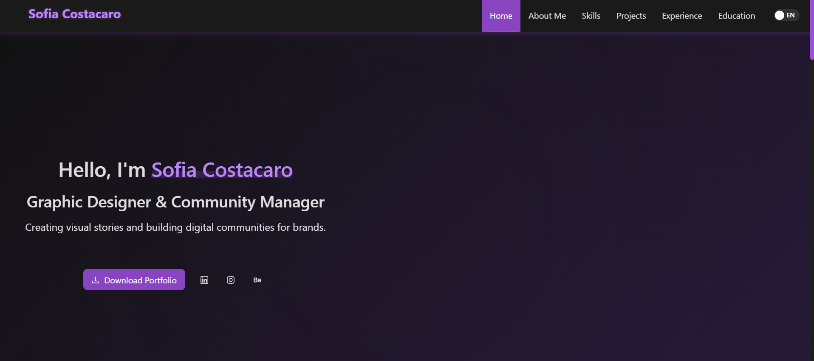

# Sofia Costacaro Portfolio

A modern, responsive portfolio website showcasing Sofia Costacaro's work as a Graphic Designer and Community Manager.



## 🚀 Features

- **Responsive Design**: Optimized for all device sizes
- **Dark Mode**: Modern dark theme with purple accents
- **Bilingual Support**: Toggle between English and Spanish
- **Animated UI Elements**: Smooth transitions and animations
- **Project Showcase**: Gallery of design projects with filterable categories
- **Professional Experience**: Timeline of work history and accomplishments
- **Skills Visualization**: Visual representation of technical skills and proficiencies

## 💻 Technologies Used

- **React**: Frontend library for building the user interface
- **TypeScript**: For type-safe code
- **Ant Design**: UI component library
- **CSS3**: Custom styling and animations
- **Context API**: For state management (language switching)
- **Responsive Design**: Mobile-first approach

## 📋 Sections

- **Home**: Introduction and hero section
- **About Me**: Personal information and background
- **Skills**: Technical skills and proficiencies
- **Projects**: Portfolio of design work
- **Experience**: Professional work experience
- **Education**: Academic background

## 🔗 Connect

- **LinkedIn**: [Sofia Costacaro - Graphic Designer](https://www.linkedin.com/in/sof%C3%ADa-costacaro-graphic-designer/)

## 🛠️ Installation and Setup

1. **Clone the repository**

   ```markdown
   git clone https://github.com/yourusername/my-portfolio.git
   ```

2. **Navigate to the project directory**

   ```markdown
   cd my-portfolio
   ```

3. **Install dependencies**

   ```markdown
   npm install
   ```

4. **Start the development server**

   ```markdown
   npm run dev
   ```

5. **Open your browser**

   Navigate to `http://localhost:5173/` to see the website in action.

## 📁 Project Structure

```
my-portfolio/
├── public/                  # Public assets
│   ├── images/              # Project images and icons
│   └── favicon.ico          # Site favicon
├── src/                     # Source code
│   ├── components/          # Reusable UI components
│   │   ├── Header/          # Site header and navigation
│   │   ├── Footer/          # Site footer
│   │   ├── ProjectCard/     # Project display component
│   │   └── ...              # Other components
│   ├── pages/               # Page components
│   │   ├── Home/            # Home page
│   │   ├── About/           # About page
│   │   ├── Projects/        # Projects gallery page
│   │   └── ...              # Other pages
│   ├── context/             # React context providers
│   │   └── LanguageContext.tsx # Language switcher context
│   ├── hooks/               # Custom React hooks
│   ├── styles/              # Global styles and themes
│   ├── App.tsx              # Main application component
│   ├── main.tsx             # Application entry point
│   └── types.ts             # TypeScript type definitions
├── .gitignore               # Git ignore file
├── tsconfig.json            # TypeScript configuration
├── package.json             # Project dependencies and scripts
├── vite.config.ts           # Vite configuration
└── README.md                # Project documentation
```

## 🔧 Customization

To customize this portfolio for your own use:

1. Update the personal information in the translation files
2. Replace project images and descriptions
3. Modify the color scheme in the theme configuration
4. Add your own sections as needed

## 📜 License

This project is licensed under the MIT License.
